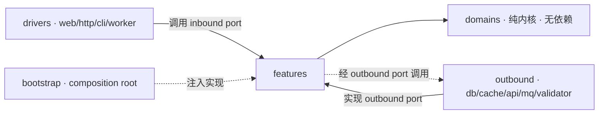

# 架构约束（Architecture）

> 本文件说明项目的架构设计、目录结构、DDD 战术与六边形适配器约束，是 "what" 的唯一真源。
> 拆分方法与理由（"how/why"）见 [`.human/splitting-rules.md`](./splitting-rules.md)。
> 规则可执行：架构依赖与边界纯度由 [`.skills/xp-validation/SKILL.md`](../.skills/xp-validation/SKILL.md) 校验；DDD 战术规范由 [`.skills/ddd-validation/SKILL.md`](../.skills/ddd-validation/SKILL.md) 校验。

## 风格

**DDD + XP + 六边形（Ports & Adapters）**。核心铁律：**依赖只能从外向内**。

- 当前项目的典型方向：`inbound/outbound/bootstrap -> features -> domains`
- 通用抽象方向：`drivers/inbound/outbound/bootstrap -> features -> domains`
- `domains` 无任何出边；`features` 通过 outbound ports 调用外部能力；`bootstrap` 只负责装配

### 快速判定（AI/Human 共用，唯一真源）

- **ARCH-R1** `domains`：零出边，不 import `features/inbound/outbound/bootstrap`
- **ARCH-R2** `features`：只依赖 `domains` 与 feature ports，不 import `inbound/outbound/bootstrap`
- **ARCH-R3** `inbound`：只调用 feature inbound ports，不直连 outbound
- **ARCH-R4** `outbound`：只实现 feature outbound ports，不依赖 inbound
- **ARCH-R5** `bootstrap`：唯一装配点，可依赖全部但不写业务流程
- **ARCH-R6** `features`：MUST NOT 使用 class 实现 use case，统一使用函数/函数工厂

### 违规与修正示例（对应规则号）

| 规则 | 违规示例 | 修正方式 |
|------|----------|----------|
| `ARCH-R1` | `src/domains/*` import `src/features/*` | 将编排逻辑移动到 `src/features/*`，domain 仅保留规则与不变量 |
| `ARCH-R2` | `src/features/*` 直接 import `src/outbound/*` | 在 `feature/port.ts` 定义 outbound port，由 `src/outbound/*` 实现并在 `bootstrap` 注入 |
| `ARCH-R3` | `src/inbound/*` 直接调用 `src/outbound/*` repository | 改为调用 feature inbound port（use case），由 feature 间接使用 outbound port |
| `ARCH-R4` | `src/outbound/*` import `src/inbound/*` 状态或页面对象 | 将 inbound 依赖改为输入参数或 feature port 语义，outbound 保持被动实现 |
| `ARCH-R5` | `src/bootstrap/*` 出现业务分支或用例判断 | 业务分支下沉到 `src/features/*`，bootstrap 只负责对象装配与启动 |
| `ARCH-R6` | `src/features/*` 使用 `class XxxUseCase` | 改为 `createXxx(deps)` 或 `xxx` 常量函数，禁止 `new` 调用链 |

## 通用依赖方向（跨前端/后端）



## 各层职责与禁止

| 层 | 职责 | 依赖 | 禁止 |
|----|------|------|------|
| `domains/` | 业务规则 / 不变量 / 状态机 / 领域服务（纯内核） | 无 | 任何 I/O；import `features/inbound/outbound/bootstrap` |
| `features/` | 用例编排：查 -> 校验 -> 调外部 -> 返回语义结果 | `domains` + ports | 直连 DB/SDK；写领域不变量；依赖具体驱动框架 |
| `inbound/` | 驱动侧实现（web/http/cli/worker 的入口、页面、状态、控制流） | feature inbound ports | 写业务不变量/跨聚合用例编排；直连 outbound |
| `outbound/` | 被驱动侧实现（db/cache/mq/api/validator） | feature outbound ports | 承载业务规则；依赖 inbound |
| `shared/` | 业务无关通用件（errors/log/utils/types） | 无业务 | 沉淀业务概念 |
| `bootstrap/` | 组装根：DI、装配、入口（仅装配） | 全部 | 写业务逻辑 / 用例流程 |

说明：当前统一使用 `inbound` / `outbound` 术语表达六边形两侧实现，不再使用 `ui/model/infrastructure/interfaces` 作为规范目录。

## 目录结构规范

### A. 前端项目（当前）

```text
src/
  domains/
  features/
  inbound/
  outbound/
  bootstrap/
  shared/
```

### B. inbound 细分（web 实现示例）

```text
src/inbound/
  web/
    events/
    routes/
    pages/
    components/
    state/
      command/
      state/
      store/
    styles/
```

### C. outbound 细分

```text
src/outbound/
  repositories/
  validators/
  gateways/
  mappers/
```

#### outbound 命名约定（实现文件）

- Repository 实现：`*.repository.ts`
- Validator 实现：`*.validator.ts`
- Gateway 实现：`*.gateway.ts`
- Mapper 实现：`*.mapper.ts`
- 文件名表达业务语义与来源，避免运行环境导向命名（如优先 `mock-*`，避免 `browser-*`）

只要依赖方向不变，目录命名可按仓库形态调整。

## 端口与领域约定

- **端口归属**：所有 ports（inbound/outbound）定义在 `features/`；`domains` 不定义 ports。
- **端口命名（inbound）**：使用 `动词 + 业务意图`，如 `LoadX`、`SwitchY`；避免 `Handle`、`Process`。
- **端口命名（outbound）**：使用业务能力命名，避免技术实现词。
- **端口签名**：输入/输出使用稳定用例语义，禁止泄漏框架原生对象（HTTP/MQ/SDK types）。
- **inbound port 形态**：MUST 使用函数类型（`(input) => Promise<Result<...>>`），不使用 `execute` 包装对象。
- **端口文件约定**：每个 feature 内固定使用 `port.ts` 承载端口接口。
- **feature 文件骨架**：每个 feature 至少包含 `index.ts`、`port.ts`、`types.ts`。
- **feature 实现形态**：MUST NOT 使用 class；`index.ts` 仅导出函数式 use case（`createXxx` 或常量函数）。
- **领域服务**：跨实体、不属于单一实体的业务逻辑放 `domains/`。
- **聚合即一致性边界**：一次事务只修改一个聚合；跨聚合使用 ID 引用并由 feature 编排。
- **边界转换 / 防腐**：outbound 负责内外模型转换（外部 DTO <-> 领域模型）。
- **边界类型校验（inbound）**：用户输入（query/form/route/body）校验放 inbound adapter。
- **边界类型校验（outbound）**：外部依赖返回（API/DB/file/mock/SDK）校验放 outbound adapter。
- **业务校验归属**：领域不变量与业务规则放 domain/feature，不放 adapter。
- **横切关注点**：日志/指标/追踪不进入 domain；由外层处理。

## DDD 战术约束

> 本节合并 DDD 专项细则，与上方架构规则共同构成唯一真源。

### 统一语言（Ubiquitous Language）
- MUST：业务术语先登记到 `.human/glossary.md`，再进入 `src/` 命名。
- MUST：领域类型、方法名、事件名使用业务词汇，不使用模糊技术词（如 `Manager`、`Helper`）表达业务概念。
- MUST NOT：在不同上下文中复用同名但含义不同的术语。

### 限界上下文（Bounded Context）
- MUST：每个上下文内保持单一语义模型；跨上下文交互使用契约或事件，不共享内部模型。
- MUST NOT：跨上下文直接引用他方领域对象实现"快捷复用"。

### 实体、值对象、领域服务
- MUST：有身份与生命周期的是实体；无身份且不可变的是值对象。
- MUST：跨实体且不归属单一实体的业务规则落在领域服务（`src/domains`）。
- MUST NOT：把业务规则放到 `src/features`、`src/inbound`、`src/outbound` 或 `src/bootstrap`。

### 领域事件
- 本项目当前不采用领域事件机制；domain 通过类型与返回结果表达业务语义。
- 页面交互事件仅用于应用层（`inbound/web/state`）命令分发，使用 `eventemitter3`。
- MUST NOT：在 domain 中定义或依赖具体事件总线实现。

### 防腐层（ACL）
- MUST：外部 DTO 与领域模型的转换只在 adapter 层进行。
- MUST：对接外部系统时，outbound adapter 承担 ACL 职责，隔离外部语义污染。
- MUST NOT：外部字段或外部错误类型直接进入 domain。

## 六边形适配器约束

> 本节合并六边形专项细则，与上方架构规则共同构成唯一真源。

### Adapter 职责边界
- `inbound` MUST：处理协议解析、页面交互、状态组织与命令分发，再调用 use case。
- `outbound` MUST：处理外部调用、重试/超时、错误映射与防腐转换。
- inbound/outbound MUST NOT：承载领域规则、聚合不变量或跨聚合用例编排逻辑。

### 一致性与事务策略
- MUST：单聚合一致性在域内保证；跨聚合由 feature 显式编排与补偿流程达成最终一致。
- SHOULD：在 feature 显式定义事务边界与失败补偿策略。
- MUST NOT：跨多个外部系统依赖单一本地事务假设强一致。

### 可观测性与横切关注点
- SHOULD：日志、指标、追踪放在 adapter 或 feature 装饰器层实现。
- MUST NOT：在 domain 引入日志 SDK、埋点 SDK 或 tracing SDK。

## 测试与验证

### 测试组织
- MUST：`tests/` 目录结构镜像 `src/`：
  - `tests/domains/<domain>/` ←→ `src/domains/<domain>/`
  - `tests/features/<feature>/` ←→ `src/features/<feature>/`
  - `tests/inbound/` ←→ `src/inbound/`
  - `tests/outbound/` ←→ `src/outbound/`
- MUST：测试文件命名 `*.spec.ts`。
- SHOULD：每个域/特性/适配器目录至少一个 spec 文件。

### 命名
- MUST：domain 测试以 `<methods-file-name>.spec.ts` 直接对应实现文件（如 `trip-plan.methods.ts` → `trip-plan.methods.spec.ts`）。
- MUST：feature 测试以 `<feature-name>.spec.ts`（如 `load-trip-plan.spec.ts`）。
- SHOULD：测试套 describe 块命名用被测函数名或场景语义（如 `describe("filterModesByContext")`），不用文件路径。

### 覆盖范围
- MUST：domain 方法 100% 覆盖公开导出（含不变量、边界、null/undefined 入参）。
- MUST：feature 用例测试覆盖成功路径 + 至少一条失败路径 + 端口交互验证。
- MUST：feature 测试 mock 全部 outbound port 接口，不调真实 adapter。
- SHOULD：adapter 测试覆盖 DTO 映射、错误翻译、重试与超时语义。
- SHOULD：关键 outbound ports 具备 contract tests，确保替换 adapter 时行为一致。

### Mock 策略
- MUST：feature 测试 mock outbound port 在 `port.ts` 中导出的 interface，不 mock domain 方法。
- MUST：domain 测试不使用任何 mock，纯函数验证。
- SHOULD：inbound 测试 mock feature 的 inbound port 类型，不 mock domain 或 outbound。
- MUST NOT：在 feature 测试中 import 真实 outbound 实现类（如 `MockTripPlanRepository`）— 必须用 interface mock。

### TDD 红绿
- 先写失败测试（red），再最小实现通过（green），再重构（refactor）。
- 测试清单在 `.ai/features/<feature>.md` 的"测试清单（先写）"中先列，逐条转红绿。

## 演进式设计（YAGNI · 简单设计）

只为当前需求写代码，不为臆测未来预留抽象。设计优先级：
**① 通过测试 -> ② 意图清晰 -> ③ 无重复 -> ④ 元素最少**。

结构按真实复杂度增长（单文件 -> 文件夹 -> 限界上下文），由校验规则持续守边界。

## 例外与偏离

### 必须写 ADR 的偏离

以下偏离 MUST 在 `.human/decisions/ADR-NNNN-*.md` 登记（用 `ADR-0000-template.md` 复制）：

1. **改变现有限界上下文边界**（合并/拆分/新增 bounded context，影响术语与依赖方向）。
2. **改变通用依赖方向口径**（如允许 feature 跨 inbound 调用、引入反向依赖）。
3. **引入或替换核心框架/技术栈成员**（如换状态库、路由库、UI 组件库）。
4. **引入跨聚合事务或放宽聚合一致性策略**（与"一次事务只修改一个聚合"冲突）。
5. **在 domain 引入框架依赖或 I/O**（与 ARCH-R1 冲突，需说明原因与回收计划）。
6. **偏离 MUST 级端口归属规则**（如允许 domains 定义 ports、inbound 直连 outbound）。

### 不需要写 ADR 的变更

- 新增 feature / domain / adapter — 走 RFC 流程即可。
- 命名风格调整、文件重命名 — tiny-change 记录即可。
- 测试补充、bug 修复 — 不影响架构边界。

### 写作要求

ADR 内容必须包含：偏离点（具体规则编号如 ARCH-R1）、原因、影响范围、回收/回顾计划。
ADR 状态一经"已接受"不可变；后续变更走新 ADR 并标记"被取代（指向新编号）"。
