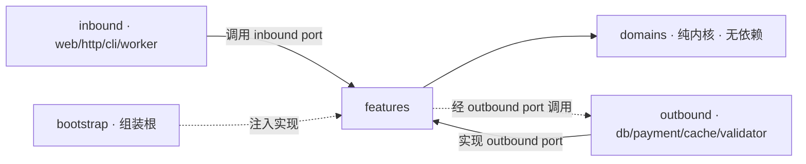

# Extreme AI Programming Template

> **目标 (Goal)**
> 一个 **AI-native** 的通用项目模板：人定义高层目标与约束，AI 通过对话拆解领域与特性、
> 先沉淀最小文档，再生成代码与测试，支撑 **XP** 式的持续迭代交付。
>
> **哲学 (Philosophy)**
> - **技术是细节，业务是资产**：语言 / 框架 / 平台皆可替换，唯有领域知识与项目意图长存
> - **业务是稳定内核，技术是可替换外壳**：内核定义契约，实现服从内核，副作用与框架被推到边缘
> - **代码即真相**：代码是唯一可执行的事实，简单、可读高于一切
> - **最小且单一**：用最少文档表达约束；每条知识只存在于一处
>
> **原则 (Principles)**
> - **文档先行、代码后行**：变更先在 `.ai/` 达成共识并经人确认，再落地实现
> - **人机分工**：人是目标 / 边界 / 架构的决策者，AI 是领域拆解与实现者
> - **长期可演进**：无冗余地图、无文档碎片，可持续更新、维护、扩展
>
> **心智模型 (Mental Model)**
> 人写"为什么"与"边界"，AI 写"是什么"与"怎么做"，代码证明"它能跑"。
> 每个功能闭环：人描述需求 → AI 校验边界、基于现有实现提出建议 → 人确认 → AI 维护变更与代码。

## 这套结构的本质：四层信息模型

整个项目只有四种信息，各司其职、互不重复，正好对应心智模型的四个动作：

| 层 | 位置 | 回答 | 内容 | 主笔 / 把关 |
|----|------|------|------|------|
| **约束层 (Human)** | [`.human/`](.human/) | 为什么 · 边界 | 项目意图、架构规则、偏好 | 人主笔 · AI 只读 |
| **认知层 (AI)** | [`.ai/`](.ai/) | 是什么 · 怎么做 | 领域与特性的压缩理解（现状） | AI 主笔 · 人确认 |
| **事实层 (Code)** | [`src/`](src/) · [`tests/`](tests/) | 它能跑 | 唯一可执行真相，测试即证明 | AI 主笔 · 人审查 |
| **变更层 (RFC)** | [`.ai/rfcs/`](.ai/rfcs/) | 为什么这样改 | 一次变更的推理与取舍过程 | AI 起草 · 人决策 |

> 约束在 `.human/` · 现状在 `.ai/` · 事实在 `src/` · 变更过程在 `.ai/rfcs/`。

---

## 目录导航

```
repo/
├── src/              # 事实层：可运行代码（DDD + 六边形）
│   ├── domains/      #   纯内核：聚合/实体/值对象/领域服务（不依赖框架）
│   ├── features/     #   按 feature 平铺（每个 feature: index.ts + port.ts + types.ts）
│   ├── inbound/      #   驱动侧实现（web 页面/路由/组件/状态）
│   ├── outbound/     #   被驱动侧实现（repositories/validators/gateways）
│   ├── bootstrap/    #   组装入口（composition root）
│   ├── mocks/        #   本地开发 mock 数据
│   └── shared/       #   通用工具（errors / logger / utils / types）
│
├── tests/            # 事实层的一部分：测试即"证明"（XP / TDD）
│
├── .human/           # 约束层（人维护）：目标、架构规则、偏好、术语、ADR
├── .ai/              # 认知 + 变更层（AI 维护、人确认）：领域/特性压缩、当前状态、流程约束、变更 RFC
├── .skills/          # 可复用技能（Agent Skills 标准：<name>/SKILL.md），跨 AI 工具
│
├── scripts/          # 自动化脚本
├── contracts/        # 外部系统 API 契约（可选，仅外部集成时需要）
└── README.md
```

> `src/` 各层为骨架，**按需生长**（单文件 → 文件夹 → 限界上下文，见 [`.human/architecture.md`](.human/architecture.md) 演进式设计）；空目录无需强行填充。

---

## 依赖方向（六边形架构）



- `domains` → 无任何依赖（纯内核）
- `features` → 依赖 `domains`；暴露 **inbound port**、声明 **outbound port**
- `inbound` → 驱动侧实现，调用 feature inbound port
- `outbound` → 被驱动侧实现，承接 feature outbound port
- `bootstrap` → 组装根（composition root），把实现注入端口

**禁止**：`feature` 直接访问数据库/SDK · `domain` 依赖 `inbound/outbound/bootstrap` · `bootstrap` 写业务逻辑。

---

## 工作原理：你如何参与

这套模板把你放在“目标与边界的决策者”位置，AI 负责领域拆解与代码实现。
任何新增或修改功能都走同一条闭环；你只在三个关键时刻参与，其余交给 AI：

1. **描述需求** —— 用业务语言说清“要什么、为什么、边界在哪”，不必关心实现细节。
2. **确认提案** —— AI 先读约束（`.human/`）与现状（`.ai/`），回问澄清、校验边界，再以一份
   **RFC**（变更提案：问题 · 方案 · 取舍 · 影响）交给你。你只需拍板：同意 / 调整 / 否决。
   **未经你确认，AI 不会动代码。**
3. **审查结果** —— 确认后，AI 以测试驱动（先写测试、再实现）落地 `src/` 代码与 `tests/`，
   跑绿架构校验、更新现状文档。你审查“证明”（测试是否通过）与最终现状。

完整闭环是这样一条线：

> **人描述需求 → AI 提案并校验边界 → 人确认 → AI 写文档与代码 → 测试证明它能跑。**
> 即“文档先行、经你确认、代码后行”——你掌握方向与否决权，AI 承担拆解与落地。

---

## 给 AI Agent

本仓库兼容多种 AI 编码工具（Claude Code / opencode / Cursor / Copilot）。
统一入口见 [`AGENTS.md`](AGENTS.md)；唯一规则源为 [`.ai/agent.md`](.ai/agent.md)。

---

## 本地预览（Bun + Vite）

```bash
bun install
bun run dev
```

可选参数：

- 局域网调试：`bun run dev -- --host`
- 指定端口：`bun run dev -- --host 0.0.0.0 --port 4173`
- 生产预览：`bun run build && bun run preview`

## Mock 数据

- 默认 trip id：`trip-jp-kansai-2026-spring`
- mock 目录：`src/mocks/trips/`
- 索引文件：`src/mocks/trips/index.json`
- 可用样例：
  - 正常数据：`trip-jp-kansai-2026-spring.json`
  - 空态数据：`trip-empty-day.json`
  - 非法数据：`trip-invalid.json`

通过环境变量切换：

```bash
VITE_TRIP_ID=trip-empty-day bun run dev
```
